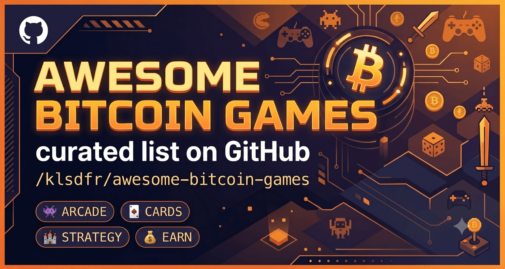
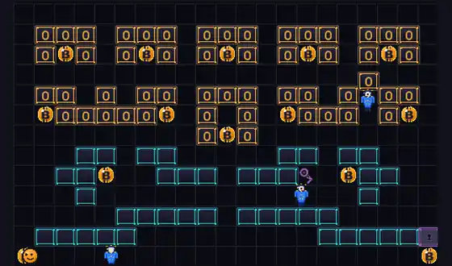

# ⚡ Awesome Bitcoin Games

**A hand-curated list of games with a _real_ Bitcoin connection — sorted by how Bitcoin actually shows up, not by crypto branding.**

There was no good single list of Bitcoin games, so here's one — kept **honest and
curated**. Some games make you _earn or wager real sats_; some run _on-chain_; most just
wear Bitcoin as a theme (push blocks, mine, dodge central bankers, dig a landfill for a
lost hard drive). Instead of hiding that behind platform categories, **every entry is
tagged with a badge that tells you exactly how Bitcoin is involved.**

> **Inclusion rule:** Bitcoin must be *meaningfully* part of the experience — core
> gameplay, the in-game economy, payments, or real rewards, **or** a genuine, specific
> Bitcoin theme. Generic "crypto", NFT, web3, and shitcoin-casino games don't make the
> list. When in doubt, an entry is marked `🎨 BTC-themed` rather than oversold.

> Every entry is **verified live** when added. Dead or migrated projects move to
> [Historical](#-historical) rather than vanishing — honesty over link-count.

> **📥 Know a Bitcoin game that belongs here?** Submit it via
> **[Pull Request](CONTRIBUTING.md)** or email **[pr@bitcoinia.org](mailto:pr@bitcoinia.org)**.
> A **preview image/GIF or a YouTube link** helps it land faster — see how the picks below
> show theirs.

## Badges

**How Bitcoin shows up** (the primary label — an entry can carry more than one):

| Badge | Meaning |
|---|---|
| `🟧 Bitcoin-native` | Bitcoin or satoshis are part of **core gameplay or the economy** |
| `⚡ Lightning` | Uses **Lightning** for payments, rewards, wagers, or withdrawals |
| `🎁 Rewards` | **Pays out real BTC/sats**, even if gameplay itself isn't Bitcoin-native |
| `⛓ On-chain` | Gameplay or transactions happen **directly on Bitcoin L1** |
| `🎨 BTC-themed` | Bitcoin is mainly the **theme or visual reference**, not central |

**Platform & access** (secondary tags): `🌐 Browser` `🎮 Steam` `📱 Mobile` `🎲 Tabletop`
`🆓 Free` `💸 Paid` `📚 Learn` `🏆 Leaderboard`

**Source & license:** `🛠 Open-source` (repo + license linked where we could confirm one) ·
`🔒 Closed-source` (proprietary). Untagged means we haven't verified the source yet —
not a claim either way. Most games here are closed-source; the open ones are the exception.

⭐ = **editor's pick** (the standouts actually worth your time).

## Contents
- [⭐ Start here](#-start-here)
- [🎬 Featured previews](#-featured-previews)
- [🟧 Bitcoin-native](#-bitcoin-native)
- [🎁 Earn real sats](#-earn-real-sats)
- [⛓ On-chain](#-on-chain)
- [🎨 BTC-themed](#-btc-themed)
- [📱 Mobile apps](#-mobile-apps)
- [🪦 Historical](#-historical)
- [How we classify games](#how-we-classify-games)
- [Contributing](#contributing)

## ⭐ Start here
New here? These are the standouts worth a click first — one per angle, so you see the full
range from "earn real sats" to "just a great Bitcoin joke":

- 🎨 **[Bitcoinia](https://bitcoinia.org)** — a free, instant-play 50-level Bitcoin
  arcade-puzzler: push ledger blocks, stack sats, climb a cheat-proof leaderboard.
  `🏆 Leaderboard` _(our game — yes, we built the list too)_
- ⚡ **[Lightning Poker](https://www.lightning-poker.com)** — real-sats No-Limit Hold'em
  where satoshis are the chips.
- ⛓ **[DOOM on Bitcoin](https://ordinals.com/inscription/466)** — the whole game inscribed
  on a single satoshi.
- 🎁 **[THNDR Games](https://www.thndr.games/bitcoin-games)** — polished arcade titles that
  pay out real sats.

## 🎬 Featured previews
The ⭐ editor's picks at a glance. Each image comes from the game's own page/store or a
gameplay video; every **▶ link points to a real YouTube video** (official trailer where one
exists, otherwise representative gameplay — labelled honestly). The
[Bitcoinia](https://bitcoinia.org) clip is our own captured replay.

<table>
<tr>
<td width="50%" valign="top">
 
⭐ <b><a href="https://bitcoinia.org">Bitcoinia</a></b> — push ledger blocks, stack sats, out-maze the fiat villains across 50 levels. <b>▶ live replay</b> (above)
</td>
<td width="50%" valign="top">
 
⭐ <b><a href="https://www.lightning-poker.com">Lightning Poker</a></b> — real-sats No-Limit Hold'em; satoshis are the chips, instant Lightning buy-in.
</td>
</tr>
<tr>
<td width="50%" valign="top">
 
⭐ <b><a href="https://ordinals.com/inscription/466">DOOM on Bitcoin</a></b> — a full DOOM clone inscribed on a single satoshi. <a href="https://www.youtube.com/watch?v=cHyRkVFX5Ew">▶ clip</a>
</td>
<td width="50%" valign="top">
 
⭐ <b><a href="https://www.thndr.games/bitcoin-games">THNDR Games</a></b> — Lightning arcade titles that pay real sats via free draws. <a href="https://www.youtube.com/watch?v=5k1PtKTRcg4">▶ gameplay</a>
</td>
</tr>
<tr>
<td width="50%" valign="top">
 
⭐ <b><a href="https://store.steampowered.com/app/3692070/One_Mans_Trash/">One Man's Trash</a></b> — dig a landfill for a lost "PitCoin" hard drive (the James Howells saga). <a href="https://www.youtube.com/watch?v=tAGKOafAPT0">▶ trailer</a>
</td>
<td width="50%" valign="top">
 
⭐ <b><a href="https://store.steampowered.com/app/1859290/Crypto_Miner_Tycoon_Simulator/">Crypto Miner Tycoon Simulator</a></b> — build rigs and run a mining business. <a href="https://www.youtube.com/watch?v=esxnaYchmO4">▶ trailer</a>
</td>
</tr>
<tr>
<td width="50%" valign="top">
 
⭐ <b><a href="https://apps.apple.com/us/app/bitcoin-billionaire/id911117141">Bitcoin Billionaire</a></b> — tap-to-get-rich idle-clicker satire (Noodlecake). <a href="https://www.youtube.com/watch?v=FB0TJisgng4">▶ official trailer</a>
</td>
<td width="50%" valign="top">
 
⭐ <b><a href="https://thebitcoingame.io/">The Bitcoin Game</a></b> — classroom Proof-of-Work sim: pick a nonce, hash, race to a valid block.
</td>
</tr>
<tr>
<td width="50%" valign="top">
 
⭐ <b><a href="https://apps.apple.com/us/app/idle-mine-tycoon-mining-game/id6689514329">Idle Mine!</a></b> — polished idle miner; withdraw real sats via ZBD. <a href="https://www.youtube.com/watch?v=25ZC8908C3o">▶ review</a>
</td>
<td width="50%" valign="top">
 
⭐ <b><a href="https://apps.apple.com/us/app/yzer-learn-bitcoin-finance/id6443545393">Yzer</a></b> — gamified Bitcoin + finance lessons that pay real sats. <a href="https://www.youtube.com/watch?v=9PmRHoiCLkI">▶ review</a>
</td>
</tr>
</table>

---

## 🟧 Bitcoin-native
Sats **are** the game — the core loop is paying, wagering, or moving real Bitcoin.

- ⭐ **[Lightning Poker](https://www.lightning-poker.com)** — No-Limit Texas Hold'em where
  satoshis are the chips; instant Lightning buy-in/cash-out, micro-stakes, no signup.
  `🟧 Bitcoin-native` `⚡ Lightning` `🌐 Browser` `🛠 Open-source`
- **[Satoshi's Place](https://satoshis.place)** — Collaborative million-pixel canvas; you
  paint each pixel by paying a 1-sat Lightning invoice. `🟧 Bitcoin-native` `⚡ Lightning` `🌐 Browser`
- **[Satoshi Settlers](https://satoshisettlers.com)** — Multiplayer strategy game where you
  settle and develop "blocks" on a shared map, staking sats over Lightning. `🟧 Bitcoin-native` `⚡ Lightning` `🌐 Browser` _(alpha — play small)_

## 🎁 Earn real sats
A different beast: gameplay isn't itself Bitcoin, but you **withdraw real sats** (prize
draws / Lightning rewards). Kept separate on purpose so it never blurs with the rest.

- ⭐ **[THNDR Games](https://www.thndr.games/bitcoin-games)** — The leading Lightning game
  studio; arcade titles (Club Bitcoin: Solitaire, Tetro Tiles, Clinch) pay sats via free
  ticket draws. `🎁 Rewards` `⚡ Lightning` `📱 Mobile`
- **[ZBD](https://zbd.gg/)** — Lightning rewards platform & SDK behind dozens of "earn
  sats" games. `🎁 Rewards` `⚡ Lightning` `📱 Mobile`
- **[Bitcoin Miner](https://zbd.gg/z/earn)** — Popular idle mining sim that pays real
  sats. `🎁 Rewards` `⚡ Lightning` `📱 Mobile` _(Fumb Games, via ZBD)_
- **[sMiles](https://www.smilesbitcoin.com)** — Rewards app with a built-in game suite
  (Arcade, Chess, BitJong) that pays sats over Lightning. `🎁 Rewards` `⚡ Lightning` `📱 Mobile`
- **[SaruTobi](https://www.mandelduck.com/sarutobi/)** — The **first mobile Bitcoin game
  (2013)**; fling a monkey, collect sats. `🎁 Rewards` `⚡ Lightning` `📱 Mobile`

## ⛓ On-chain
The game — or its moves — live **directly on Bitcoin L1**.

- ⭐ **[DOOM on Bitcoin](https://ordinals.com/inscription/466)** — A full DOOM clone
  inscribed on a single satoshi (Ordinals #466); runs in-browser straight from chain
  data, no server. `⛓ On-chain` `🌐 Browser`
- **[Bitcoin Chess](https://supertestnet.github.io/bitcoin-chess/bitcoin-chess.html)** —
  Two players play a full game where **every move is a real Bitcoin transaction** (via
  pubkey tweaking). `⛓ On-chain` `🌐 Browser` `🛠 Open-source` `📚 Learn` _(testnet demo — don't spam mainnet)_

## 🎨 BTC-themed
Bitcoin is the **setting, story, or joke** — the in-game coins aren't real. Play for fun.

- ⭐ **[Bitcoinia](https://bitcoinia.org)** — Retro arcade-puzzler: push ledger blocks,
  stack sats and out-maze the fiat villains across 50 levels, on a server-verified,
  cheat-proof leaderboard. `🎨 BTC-themed` `🌐 Browser` `🆓 Free` `🏆 Leaderboard` _(maintained by this list's authors)_
- **[BTC: Proof of Play](https://btcproofofplay.itch.io/btcproofofplay)** — Hearthstone-style
  1v1 card battler where "Hashrate" is mana and "Network Integrity" is your health.
  `🎨 BTC-themed` `🌐 Browser` `🆓 Free`
- **[Shitcoin Survivors](https://mythography.itch.io/shitcoinsurvivors)** — Vampire-Survivors-style
  roguelite where a Bitcoin maxi cleanses the "Shitcoin Swamps." `🎨 BTC-themed` `🌐 Browser` `📱 Android` `🆓 Free`
- **[CryptoDefender](https://satoshininjamoto.itch.io/cryptodefender)** — Survive waves of
  "Central Bankers" coming for your coins, across three 90-second levels. `🎨 BTC-themed` `🌐 Browser` `🆓 Free`
- **[Bitcoin Catcher](https://candyarcade.itch.io/bitcoin-catcher)** — Casual catcher: grab
  the falling bitcoins, dodge the market crash. `🎨 BTC-themed` `🌐 Browser` `📱 Android` `🆓 Free`
- **[Indie Joe — Find The Bitcoin](https://helixgem.itch.io/indie-joe-find-the-bitcoin)** —
  Short 2D platformer hunting a hidden Bitcoin artifact. `🎨 BTC-themed` `🌐 Browser` `🆓 Free`
- **[Bitcoin Clicker](https://nightcubegames.itch.io/bitcoin-clicker)** — Minimal idle
  clicker: tap the coin, buy upgrades, repeat. `🎨 BTC-themed` `🌐 Browser` `🆓 Free`
- ⭐ **[One Man's Trash](https://store.steampowered.com/app/3692070/One_Mans_Trash/)** —
  Satirical dig-'em-up: a washed-up crypto bro vacuums a landfill for a lost "PitCoin"
  hard drive — inspired by the real James Howells 8,000-BTC saga. `🎨 BTC-themed` `🎮 Steam` `💸 Paid`
- ⭐ **[Crypto Miner Tycoon Simulator](https://store.steampowered.com/app/1859290/Crypto_Miner_Tycoon_Simulator/)** —
  Build rigs and run a mining business across scenarios; the best-reviewed mining
  tycoon. `🎨 BTC-themed` `🎮 Steam` `💸 Paid`
- **[Bitcoin Tycoon — Mining Simulation](https://store.steampowered.com/app/734570/Bitcoin_Tycoon__Mining_Simulation_Game/)** —
  Start mining in "early 2014" and build a BTC empire. `🎨 BTC-themed` `🎮 Steam` `💸 Paid`
- **[Bitcoin Mining Tycoon](https://store.steampowered.com/app/884500/Bitcoin_Mining_Tycoon/)** —
  Colorful tap-to-mine farm builder. `🎨 BTC-themed` `🎮 Steam` `💸 Paid`
- **[Call of Bitcoin](https://store.steampowered.com/app/836260/Call_of_Bitcoin/)** — Tiny
  action platformer: collect bitcoins, blast monsters. `🎨 BTC-themed` `🎮 Steam` `💸 Paid`
- ⭐ **[Bitcoin Billionaire](https://apps.apple.com/us/app/bitcoin-billionaire/id911117141)** —
  Tap-to-get-rich idle clicker satire; a genuine casual classic. [Android](https://play.google.com/store/apps/details?id=com.noodlecake.bitcoin)
  `🎨 BTC-themed` `📱 Mobile` `🆓 Free` _(Noodlecake)_
- ⭐ **[The Bitcoin Game](https://thebitcoingame.io/)** — Polished classroom Proof-of-Work
  sim: pick a nonce, hash, and race to a valid block across 10 rounds. `🎨 BTC-themed` `📚 Learn` `🌐 Browser` `🆓 Free`
- **[SHAmory](https://shamory.com/)** — Memory/card game (and picture books) that teach
  mining and Proof-of-Work. `🎨 BTC-themed` `📚 Learn` `🎲 Tabletop`
- **[HODL UP](https://www.freemarketkids.com/products/hodl-up-a-bitcoin-mining-game)** —
  Bitcoin-mining board game for families. `🎨 BTC-themed` `🎲 Tabletop` _(Free Market Kids)_
- **[Mission Bitcoin](https://www.amazon.com/dp/B0D4TND95G)** — Kid-friendly board game:
  collect 21 "bitcoin" tokens. `🎨 BTC-themed` `🎲 Tabletop` _(LFGO)_

---

## 📱 Mobile apps
Bitcoin games you actually install — direct **App Store / Google Play** links, with live
store ratings where we could verify them. **This is a platform cross-cut:** the Lightning/
rewards titles below also belong to the sections above; here they're bundled so you can grab
a phone game in one tap. Ratings are store figures seen **June 2026** and will drift — and a
high store score ≠ guaranteed payout, so withdraw small first on the "earn sats" apps.

### ⚡ Earn real sats (Lightning rewards)
- ⭐ **[THNDR Games](https://apps.apple.com/developer/thndr-games/id1487339631)** — the leading
  Lightning game studio; every title funnels free tickets into real-sats BTC prize draws:
  - **Club Bitcoin: Solitaire** — classic solitaire, hourly Lightning draws.
    [iOS](https://apps.apple.com/us/app/club-bitcoin-solitaire/id1619992672) ·
    [Android](https://play.google.com/store/apps/details?id=com.thndrgames.solitaire)
    `⚡ Lightning` `🎁 Rewards` `📱 Mobile` `🆓 Free` _(iOS 4.7★ · 2.1K)_
  - **Tetro Tiles – Block Puzzle** — Tetris-style; daily BTC draw.
    [iOS](https://apps.apple.com/us/app/tetro-tiles-block-puzzle/id1662479953) ·
    [Android](https://play.google.com/store/apps/details?id=com.thndrgames.blocks)
    `⚡ Lightning` `🎁 Rewards` `📱 Mobile` `🆓 Free` _(iOS 4.8★ · 1K)_
  - **Clinch – PvP Bitcoin Games** — skill-based PvP wagering with real BTC.
    [iOS](https://apps.apple.com/us/app/clinch-pvp-bitcoin-games/id6479753271)
    `⚡ Lightning` `🎁 Rewards` `📱 Mobile` _(iOS 4.7★ · 146)_
- ⭐ **[Idle Mine! — Tycoon Mining Game](https://apps.apple.com/us/app/idle-mine-tycoon-mining-game/id6689514329)** —
  Fumb Games' polished idle miner; withdraw real sats via ZBD.
  [Android](https://play.google.com/store/apps/details?id=com.fumbgames.minersofbitcoin)
  `🎁 Rewards` `⚡ Lightning` `📱 Mobile` `🆓 Free` _(iOS 4.8★ · 14K)_
- **[Bitcoin Miner: Idle Tycoon](https://apps.apple.com/us/app/bitcoin-miner-idle-tycoon/id1413770650)** —
  the OG Fumb idle miner, 7M+ players, real sat payouts via ZBD.
  [Android](https://play.google.com/store/apps/details?id=com.fumbgames.bitcoinminor)
  `🎁 Rewards` `⚡ Lightning` `📱 Mobile` `🆓 Free` _(iOS 4.7★ · 52K)_
- **[Blocks of Bitcoin](https://apps.apple.com/us/app/blocks-of-bitcoin-puzzle-game/id6743409638)** —
  Fumb block-puzzle, ~3 sats/level via ZBD.
  [Android](https://play.google.com/store/apps/details?id=com.fumbgames.bitcoinblockstm)
  `🎁 Rewards` `⚡ Lightning` `📱 Mobile` `🆓 Free` _(iOS 4.6★ · 570)_
- **[ZBD](https://apps.apple.com/us/app/zbd-earn-bitcoin-rewards/id1484394401)** — Lightning
  rewards wallet + game hub behind many "earn sats" titles.
  [Android](https://play.google.com/store/apps/details?id=io.zebedee.wallet)
  `🎁 Rewards` `⚡ Lightning` `📱 Mobile` _(iOS 4.6★ · 11K; off-store reputation mixed — verify payouts)_
- **[sMiles](https://apps.apple.com/us/app/smiles-bitcoin-rewards/id1492458803)** — move/play/
  learn-to-earn suite (Chess, BitJong, Fort Nakamoto).
  [Android](https://play.google.com/store/apps/details?id=com.smilesbitcoin.smiles)
  `🎁 Rewards` `⚡ Lightning` `📱 Mobile` _(iOS 4.5★ · 4.7K; Play notably lower — payout/step-tracking complaints)_
- **[SaruTobi](https://apps.apple.com/us/app/sarutobi-make-the-monkey-fly/id1527644721)** — the
  **first mobile Bitcoin game (2013)**, relisted as the first iOS game with native ZBD Lightning sats.
  `⚡ Lightning` `🎁 Rewards` `📱 Mobile` _(iOS only; historic, few ratings)_

### 📚 Learn-to-earn & themed
- ⭐ **[Yzer — Learn Bitcoin & Finance](https://apps.apple.com/us/app/yzer-learn-bitcoin-finance/id6443545393)** —
  gamified Bitcoin + finance lessons that pay real sats to any Lightning wallet.
  [Android](https://play.google.com/store/apps/details?id=io.wizzer.academy)
  `📚 Learn` `⚡ Lightning` `🎁 Rewards` `📱 Mobile` _(iOS 4.8★ · 81)_
- **[Simple Bitcoin — Learn & Earn](https://apps.apple.com/us/app/simple-bitcoin-learn-earn/id1487375777)** —
  Bitcoin-only curriculum; quizzes earn sat spins (paywall for unlimited).
  [Android](https://play.google.com/store/apps/details?id=com.simplecrypto.applearning.cryptoapp)
  `📚 Learn` `📱 Mobile` _(iOS 4.8★ · 280)_
- ⭐ **[Bitcoin Billionaire](https://apps.apple.com/us/app/bitcoin-billionaire/id911117141)** —
  tap-to-get-rich idle satire; a genuine casual classic.
  [Android](https://play.google.com/store/apps/details?id=com.noodlecake.bitcoin)
  `🎨 BTC-themed` `📱 Mobile` `🆓 Free` _(iOS 4.8★ · 19K — Noodlecake)_

> **Left off on purpose:** crash/casino "earn BTC" apps (e.g. *Chicken or Crash*) and
> near-zero-payout reward apps (*Bitcoin Blast*) — real sats, but casino mechanics or
> misleading payouts. Pure "Bitcoin mining" idle clickers with **no** real sats are
> theme-only and don't qualify.

---

## 🪦 Historical
Kept for the record — **do not** treat these as live Bitcoin games.

- **[Satoshi Dice](https://satoshidice.com/)** — The **first Bitcoin gambling game** (2012,
  Erik Voorhees): you bet by sending an on-chain transaction to a fixed-odds address. A
  genuine landmark, but the live site now markets itself as **Bitcoin Cash**, not BTC.
- **[Bitcoin Bounty Hunt](https://donnerlab.itch.io/bitcoin-bounty-hunt)** — A Lightning-native
  FPS where kills paid real sats; **discontinued (2021)**.
- **Lightnite** — the 2019/2020 "Lightning Fortnite" (Satoshi's Games) **migrated to Solana
  NFTs in 2022**; the Bitcoin build survives only as "Legacy."
- **satoshis.games** — the original Lightning play-to-earn launcher (BCraft, Lightning
  Agar…) is **defunct**; the company pivoted to web3.
- **EscapeQR** — a Lightning Pac-Man where the invoice's QR code *was* the maze; the site
  is now **offline**.
- **Turbo '84 / Bitcoin Bounce** — early THNDR Lightning-rewards arcade titles, **delisted**
  as the studio moved to new games. (A "Bitcoin Rally" was often cited but never had a
  verifiable public listing.)

---

## How we classify games
The badge is about **how central Bitcoin is**, in this order of "realness":

1. **`🟧 Bitcoin-native`** — remove Bitcoin and the game stops working: sats are the
   chips, the stake, the canvas, the economy.
2. **`⛓ On-chain`** — the game (or its moves/state) actually lives on Bitcoin L1
   (inscriptions, transactions-as-moves).
3. **`🎁 Rewards` + `⚡ Lightning`** — the game is normal, but you withdraw **real sats**.
   These stay in their own section so "play for fun" and "play for money" never blur.
4. **`🎨 BTC-themed`** — Bitcoin is the setting, satire, or art; the coins aren't real.
   This is also where we put anything only *loosely* Bitcoin, rather than overselling it.

`⚡ Lightning` can accompany any of the above when Lightning is the rail. If a project
**migrates off Bitcoin** (e.g. to another chain) or **goes dark**, it moves to
[Historical](#-historical) instead of being deleted. Not on the list: generic crypto/NFT/
web3 titles, shitcoin casinos, and anything where "Bitcoin" is incidental.

## Contributing
PRs welcome — add live, genuinely Bitcoin games with a working **official** link (no
referral/affiliate links), one concise line, and the right badges. Prefer a
**[Pull Request](CONTRIBUTING.md)**; or email **[pr@bitcoinia.org](mailto:pr@bitcoinia.org)**
if that's easier. **Bonus:** attach a preview image/GIF or a YouTube link so we can feature
it. See **[CONTRIBUTING.md](CONTRIBUTING.md)**.

## License

To the extent possible under law, the contributors have waived all copyright and related
rights to this work ([CC0 1.0 Universal](LICENSE)).
